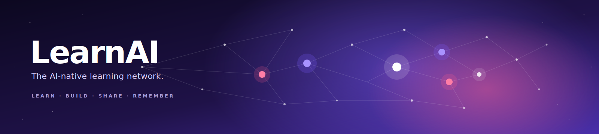

<div align="center">



# LearnAI

### The AI-native learning network for builders, creators, and curious people.

LearnAI turns the AI firehose into personalized 5-minute Sparks, practical challenges, and shareable projects.

**Learn what matters. Build what sticks. Share what helps others.**

[](./app/src/__tests__) [](./.github/workflows/build-and-publish-dist.yml) [](#license) [](#-tech) [](./docs/vision.md)

**Live demo →** [`learnai-b94d78.cloud-claude.com`](https://learnai-b94d78.cloud-claude.com) · **Wiki →** [`docs/INDEX.md`](./docs/INDEX.md) · **Pitch →** [`docs/pitch-deck.md`](./docs/pitch-deck.md)

· **Contact Email →** [`LearnAI@useyl.com`](mailto:LearnAI@useyl.com)
</div>

---

## 💡 What this is

AI is moving faster than traditional education can keep up.

The most useful insight might be buried inside a YouTube video, a paper, a Hacker News thread, a release note, a newsletter, or a founder's weekend experiment.

The problem isn't that the knowledge doesn't exist. The problem is that it's scattered, long, unstructured, and not shaped around what *you* are trying to learn or build.

**LearnAI is a new shape for AI education.**

A daily learning network where people consume, create, and share bite-size AI knowledge. Each lesson is a **Spark** — short, practical, personalized, and designed to end with understanding, action, or something you can build.

Over time, LearnAI becomes more than a learning app. It becomes your **living AI profile**: what you learned, what you built, what you taught, what you're curious about, and where you're going next.

---

## 🧱 The problem

Every existing way to keep up with AI is broken.

Twitter is a firehose.

YouTube wants 47 minutes you don't have.

Courses go stale.

Newsletters are linear.

Vendor academies are biased toward their own tools.

Most learning products help you consume, but not apply.

Most professional networks show what you *claim*, not what you actually *do*.

Duolingo proved bite-size learning can become a daily behavior. But AI needs a different model.

AI changes weekly. AI learning must be **current**, **personal**, **practical**, and turn into **visible work**.

That's what LearnAI is built for.

→ Full breakdown: [`docs/problem.md`](./docs/problem.md).

---

## 🌅 Why now

For the first time, AI can reshape education at the unit level.

→ A long video can become a 60-second Spark.
→ A release note can become a practical challenge.
→ A project can become a Build Card.
→ A user's goals, skill, gaps, and interests can shape what they learn next.
→ A creator can turn their expertise into reusable learning without building a course.

This wasn't possible at scale before.

> **The old model was fixed curriculum. The new model is a living graph of knowledge, people, projects, and proof of work.**

---

## ⚙️ How it works

LearnAI is built around four loops.

### 1. Learn

Personalized Sparks based on your goals, skill, interests, and progress.

Sparks are short by design. Not watered down — *compressed signal*.

### 2. Build

Learning should create output.

Some Sparks explain. Some quiz. Some simulate real situations. Some end with **Build Cards** that paste straight into Claude Code, Cursor, or any AI coding environment.

The point isn't to finish lessons. The point is to build confidence through action.

### 3. Share

Every useful insight can become a Spark.

Creators, builders, researchers, operators, and educators distill what they know into bite-size learning. A great video, post, repo, paper, or workflow becomes something others learn from.

Creators get attribution, distribution, and eventually monetization.

### 4. Remember

LearnAI has a cognition layer.

It remembers what you're trying to learn, what you already understand, what you keep missing, what you built, and the kinds of examples that move you faster.

Your memory is **visible, editable, exportable, and deletable**.

---

## 🌐 Why it's social

Learning AI is no longer a private course you complete alone.

People learn by watching what others build. Creators learn by teaching. Builders learn by shipping. Communities learn by remixing each other's work.

LearnAI is a social network for education and applied work.

> **The feed is not status updates. The feed is useful Sparks, Build Cards, projects, mistakes, workflows, examples, and lessons learned.**

> **The profile is not a resume. The profile is a living record of what you learned, built, taught, and shared.**

The network isn't just who you know. The network is what knowledge you helped distribute.

---

## 🎯 Mission

**Make AI literacy practical, personal, and accessible to everyone.**

From a curious student to a product leader, from a creator to a researcher, from someone learning the basics to someone shipping agents every week — LearnAI helps people stay current and turn knowledge into action.

---

## 🌌 Vision

LearnAI is the **education network for the AI era**.

A place where people learn from the frontier without drowning in it.

A place where creators turn expertise into Sparks, get credited, and grow an audience.

A place where builders show progress through real work — not bullet points on a CV.

A place where knowledge spreads faster because it is short, useful, credited, and remixable.

A place where your learning path becomes your public proof of growth.

The future of education won't look like a static course catalog. It will look like a **living network of people, knowledge, projects, and memory.**

LearnAI is building that network.

→ Full vision: [`docs/vision.md`](./docs/vision.md).

---

## 🪨 Principles

### Bite-size by default
Five minutes isn't a gimmick. It's the right unit for a field that changes every week.

### Practical over passive
You don't pass by tapping the right answer. You progress by understanding, applying, building, and sharing.

### Personalized, not generic
The same path shouldn't be shown to a 12-year-old beginner, a working PM, a senior engineer, and a researcher tracking the frontier.

### Open by design
Engine, curriculum, and cognition layer are inspectable, forkable, and extensible. MIT licensed.

### Creators get credit
The best AI learning content already exists across the internet. LearnAI helps people distill it, attribute it, and distribute it.

### Memory belongs to the user
You can see, edit, forget, wipe, and export what the system remembers. Privacy parity is non-negotiable.

---

## ✨ What's in the MVP

- 🌌 **12 Constellations × 10 Levels** — ~480 hand-authored micro-lessons across AI Foundations, LLMs & Cognition, Memory & Safety, AI PM, AI Builder mindset, Cybersecurity, Cloud, AI Dev Tools, AI Trends, Frontier Companies, AI News, Open Source AI.
- ⚡ **8 Spark formats** — MicroRead · Tip & Trick · Quick Pick · Pattern Match · Fill the Stack · Field Scenario · Build Card · Boss Cell.
- 🎯 **Personalized onboarding** — age band, skill level, interests, daily minutes, goals.
- 🔥 **Game mechanics that serve practice** — XP, Focus, Build Streak, Guild Tiers, 14 Badges.
- 🧠 **Cognition layer (mem0)** — opt-in, self-hosted, inspectable.
- 📚 **"Your Memory" tab** — see, edit, forget, wipe, export.
- 📊 **Per-topic + global dashboards** — sparkline, radar, ring, bars, 12-week heatmap.
- ✅ **Tasks tab** — capture YouTube watches, articles, Build Cards.
- 🛠 **Admin Console (7 tabs)** — Users · Analytics · Memory · Emails · Tuning · Content · Prompt Studio · Config.
- 🔐 **Gmail-only sign-in** via Google Identity Services. Demo mode runs locally; production mode verifies the Google ID token on the mem0 server and returns a 7-day session JWT that works across devices.
- 📦 **Static SPA** that auto-rebuilds on every push to `main`. Deploys anywhere with zero config.

> The in-app experience is called **BuilderQuest** — the gamified, mascot-led learning shell that runs on top of the LearnAI network.

Honest list of what's shipped vs. coming: [`docs/mvp.md`](./docs/mvp.md).

---

## 👥 Who it's for

### Curious learners
People who want to understand AI without drowning in jargon, newsletters, and long videos.

### Builders
People who want to turn learning into projects, prototypes, workflows, and real output.

### Product people and operators
People who need to stay current, make better decisions, and understand what AI makes possible.

### Engineers and researchers
People who want a faster way to track the frontier and convert signal into experiments.

### Creators
People with great taste, expertise, or audience who want to turn what they know into bite-size education — credited and discoverable.

### Educators and communities
People who want to fork the engine and run a learning network for their own domain.

Full personas: [`docs/use-cases.md`](./docs/use-cases.md).

---

## 🏁 The end game

LearnAI becomes the **social network of education for the AI era**.

People come to LearnAI to learn what matters, share what they know, and show what they built.

→ **Creators** distribute knowledge, grow audiences, and monetize practical education.
→ **Builders** stay sharp, ship projects, and build a public body of work.
→ **Communities** turn scattered expertise into shared learning paths.
→ **Companies and collaborators** discover people through proof of work, not credentials.

The long-term arc is simple:

> **Knowledge becomes Sparks. Sparks become practice. Practice becomes projects. Projects become profiles. Profiles become opportunity.**

LearnAI is where people learn, build, teach, and get discovered.

→ Long version: [`docs/vision.md`](./docs/vision.md) · [`docs/roadmap.md`](./docs/roadmap.md).

---

## 🚀 Try it

### In a browser, right now

[`https://learnai.cloud-claude.com`](https://learnai.cloud-claude.com) — production deployment with server-verified Google sign-in (7-day sessions, cross-device).

[`https://learnai-b94d78.cloud-claude.com`](https://learnai-b94d78.cloud-claude.com) — public sandbox.

### Locally (demo mode, no backend)

```bash
git clone https://github.com/oznakash/learnai
cd learnai
npm install     # delegates to ./app
npm run dev     # local dev at http://localhost:5173
npm test        # vitest, 122 / 122
npm run build   # static SPA → ./dist
```

Demo mode lets you try LearnAI with no server: paste any Google OAuth Client ID (or use the Skip-OAuth shortcut with a `@gmail.com` address). Progress lives in localStorage.

> The project lives in `./app`. The root `package.json` proxies every script there. The built output lands in `/dist/` at the repo root and is **auto-committed by GitHub Actions** so static-mirror deployers serve a working SPA immediately.

### Production install (server-verified Google sign-in)

Five steps end-to-end: provision Postgres+pgvector, deploy the [mem0 fork](https://github.com/oznakash/mem0), provision a Google OAuth client, set repo variables, redeploy.

**→ Full walkthrough in [`INSTALL.md`](./INSTALL.md).** Also see [`docs/server-auth-plan.md`](./docs/server-auth-plan.md) for the architecture rationale and [`docs/mem0.md`](./docs/mem0.md) for cognition-layer specifics.

The production path runs entirely on the existing mem0 server — no extra service. mem0 verifies Google ID tokens against Google's JWKS, mints a 7-day session JWT signed with `JWT_SECRET`, and gates admin-only UI through an `ADMIN_EMAILS` env-var allowlist.

```bash
# Local (Docker) self-host of the cognition layer:
cp .env.example .env             # set OPENAI_API_KEY etc.
docker compose -f docker-compose.mem0.yml up -d

# Or one-command Fly deploy:
OPENAI_API_KEY=sk-... npm run deploy:mem0
npm run smoke:memory -- https://learnai-mem0.fly.dev <bearerKey>
```

---

## 📚 Documentation library — the wiki

Everything is Markdown in [`docs/`](./docs). Strategy, technical, operator. Nothing's hidden in a Notion.

| 🧭 Strategy | 🛠 Technical | 🌍 Community |
|---|---|---|
| [`vision.md`](./docs/vision.md) — mission, end game | [`architecture.md`](./docs/architecture.md) — system diagram | [`contributing.md`](./docs/contributing.md) — how to PR |
| [`problem.md`](./docs/problem.md) — what we're solving | [`technical.md`](./docs/technical.md) — services + types | [`fork-recipe.md`](./docs/fork-recipe.md) — fork for your domain |
| [`use-cases.md`](./docs/use-cases.md) — personas | [`mem0.md`](./docs/mem0.md) — cognition layer | |
| [`competitors.md`](./docs/competitors.md) — landscape | [`ux.md`](./docs/ux.md) — UX of memory | |
| [`pitch-deck.md`](./docs/pitch-deck.md) — 12 slides | | |
| [`mvp.md`](./docs/mvp.md) — what's shipped | | |
| [`roadmap.md`](./docs/roadmap.md) — what's next | | |

→ Full index: [`docs/INDEX.md`](./docs/INDEX.md)

---

## 🏗 Tech

**React 19 · Vite 8 · TypeScript · Tailwind 3 · Vitest** for the SPA.
**mem0 · Postgres + pgvector · Fly.io / Cloud-Claude** for the cognition + auth layer.
**Google Identity Services + server-verified ID-token exchange** for Gmail-only auth — sessions are 7-day JWTs signed by mem0.
The SPA stays static; everything stateful is on the existing mem0 server.

488 KB JS / 29 KB CSS gzipped, 77 modules. 122 / 122 tests across 14 files.

---

## 🤝 Contributing

> _Built for the community of builders, creators, and learners._

Open a PR. Add a Spark. Distill a great source. Improve a Build Card. Fix the engine. Fork LearnAI for your own domain.

**Five flavors of contribution → [`docs/contributing.md`](./docs/contributing.md).**

The 30-second pitch:

- 🐛 Bug fix → PR with a test.
- 📚 New Spark → edit a topic file in `app/src/content/topics/*.ts`, or use the Admin Prompt Studio to distill from a source URL.
- 🛠 New Build Card → same. Test it end-to-end first.
- 🌐 New Constellation → open an issue first.
- 🧠 Engine work → standard PR. Tests required.

Every Spark you author is credited to you. Every useful contribution makes the network smarter.

---

## 🔧 Project layout

```
learnai/
├── README.md                       ← you are here
├── CLAUDE.md                       ← operator manual for AI agents
├── docs/                           ← the wiki (strategy + technical)
│   ├── INDEX.md                    ← documentation table of contents
│   ├── hero.svg                    ← README hero banner
│   ├── vision.md
│   ├── problem.md
│   ├── use-cases.md
│   ├── competitors.md
│   ├── pitch-deck.md
│   ├── architecture.md
│   ├── mvp.md
│   ├── roadmap.md
│   ├── contributing.md
│   ├── fork-recipe.md
│   ├── ux.md                       (cognition-layer UX)
│   ├── technical.md                (engineer's view)
│   └── mem0.md                     (cognition layer in depth)
├── app/                            ← the SPA (BuilderQuest experience)
│   ├── src/
│   │   ├── App.tsx
│   │   ├── auth/                   ← Gmail-only sign-in
│   │   ├── content/                ← 12 topic seed files + prompt builder
│   │   ├── store/                  ← PlayerContext, game logic, badges
│   │   ├── memory/                 ← MemoryService (offline + mem0 client)
│   │   ├── admin/                  ← Admin Console (7 tabs)
│   │   ├── views/                  ← Home, TopicView, Play, Tasks, Memory, …
│   │   ├── components/             ← TopBar, TabBar, Exercise renderer
│   │   ├── visuals/                ← Mascot, Illustrations, Charts, Confetti
│   │   └── __tests__/              ← Vitest
│   └── package.json
├── dist/                           ← auto-built static SPA (GitHub Actions)
├── docker-compose.mem0.yml         ← self-host the cognition layer
├── fly.toml                        ← one-command Fly deploy
├── scripts/
│   ├── deploy-mem0.sh              ← idempotent Fly deploy
│   └── smoke-memory.mjs            ← end-to-end smoke test
├── Dockerfile                      ← multi-stage SPA → nginx
├── nginx.conf                      ← gzip, cache, SPA fallback
├── vercel.json · netlify.toml · static.json
└── package.json                    ← root, delegates to ./app
```

---

## 🪪 License

[MIT](./LICENSE) — for the engine *and* every fork. Contribute back.

---

<div align="center">

**Built for people who want to learn faster, build more, and help others keep up.**

→ [Open the live demo](https://learnai-b94d78.cloud-claude.com) · [Read the vision](./docs/vision.md) · [Open a PR](./docs/contributing.md)

</div>
