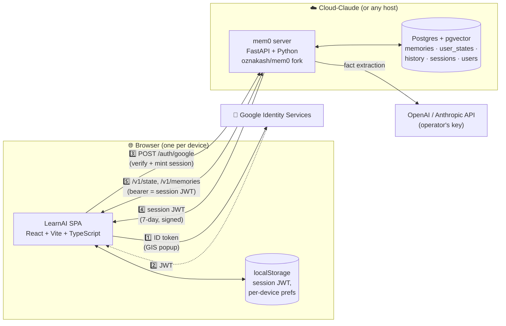
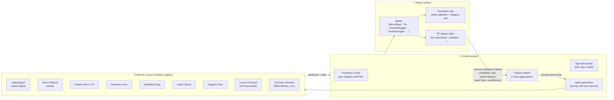
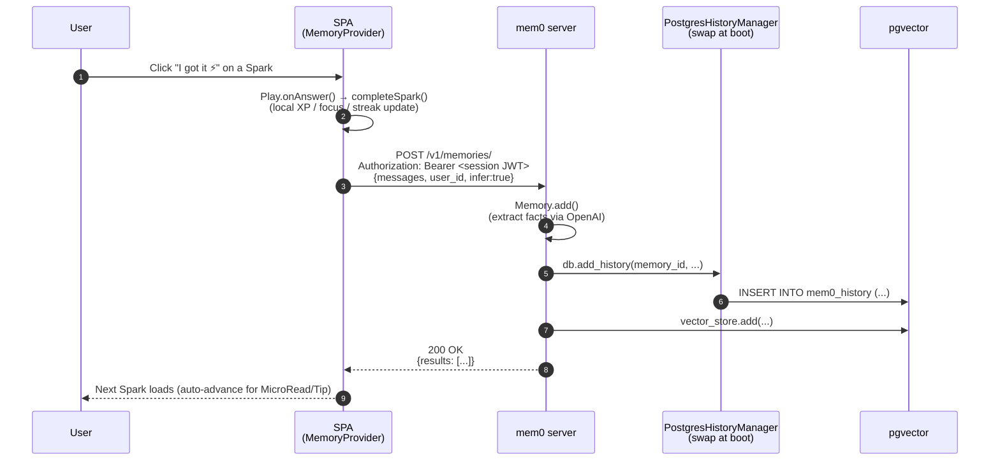
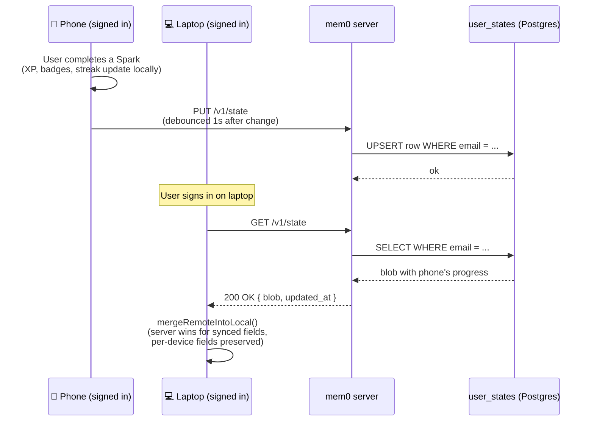

# Architecture

> _A static SPA in front, a self-hosted mem0 service behind, one Postgres for everything stateful. Designed to fit on a single Markdown page, deploy in a morning, and survive a rebuild without losing a thing._

For implementation details, see [`technical.md`](./technical.md). For cognition-layer specifics, see [`mem0.md`](./mem0.md). For the auth flow design + rationale, see [`server-auth-plan.md`](./server-auth-plan.md).

---

## High-level diagram



Two services, one database. **Everything stateful is in Postgres** — memories, the audit trail, user accounts, sessions, and per-user PlayerState (XP, streak, profile, history…). Container rebuilds lose nothing. The SPA is static and stateless.

---

## Box-by-box

### 1. The SPA — `oznakash/LearnAI`

| | |
|---|---|
| **Where it runs** | Any static host. Today: `learnai.cloud-claude.com`. Could be Cloudflare Pages, Vercel, Netlify, S3+CloudFront, your own nginx — every config is in repo. |
| **What it builds to** | `/dist/` at the repo root. GitHub Actions auto-rebuilds + auto-commits on every push to `main` (`.github/workflows/build-and-publish-dist.yml`). Static-mirror hosts get a working SPA without running a build. |
| **Identity in the SPA** | Session JWT issued by mem0, stored in `PlayerState.serverSession`. Validated by `isSessionExpired()` on hydrate; expired sessions are dropped automatically. |
| **Routing** | HTML5 path routing via `app/src/store/router.ts` (~50 lines, no library). Refresh on `/dashboard`, `/topic/ai-foundations`, `/admin` etc. stays put. |
| **State on this device** | `localStorage`. Per-device-only fields (session JWT, demo-mode Client ID, local API key) never leave the device. Everything else (profile, XP, streak, history, badges, tasks, prefs, opt-out) syncs to mem0 via `/v1/state`. |
| **Tech** | React 19 · TypeScript · Tailwind 3 · Vitest. ~78 modules · ~488 KB JS / ~29 KB CSS gzipped. Single bundle. |

### 2. mem0 server — `oznakash/mem0`

A fork of [`mem0ai/mem0`](https://github.com/mem0ai/mem0) with five mods stacked for LearnAI's deploy:

| What we added | Why |
|---|---|
| `POST /auth/google` | Verifies a Google ID token, mints a 7-day session JWT signed with `JWT_SECRET`, returns `is_admin` from the `ADMIN_EMAILS` allowlist. |
| `GET /auth/session` | Validates a session JWT for the SPA on app load. (Renamed from `/auth/me` to avoid colliding with the upstream dashboard router.) |
| `GET /auth/config` | Public, unauth'd handshake — returns the operator's `GOOGLE_OAUTH_CLIENT_ID` so a fresh-localStorage SPA can self-heal without the operator pasting it. |
| `GET /auth/admin/status` | Admin-only env-config snapshot for the in-app **Admin → Memory → Server config** panel. Booleans only for secrets — values never transmit. |
| `GET / PUT / DELETE /v1/state` | Per-user JSON blob (`user_states` table) for cross-device PlayerState sync. Bearer = session JWT. 256 KB cap. |
| `PostgresHistoryManager` swap | mem0's stock SQLite history-DB lived at `HISTORY_DB_PATH` — ephemeral on hosts without volume mounts. We swap it at startup for a Postgres-backed adapter so the audit trail persists in the same DB as the memories. No volume needed. |

The original `/v1/memories/`, `/search`, etc. stay unchanged — upstream mem0 contract preserved.

### 3. Postgres — single source of truth for everything stateful

| Table | What's in it |
|---|---|
| `memories` (pgvector) | mem0's vector store of extracted facts. The cognition layer's primary index. |
| `mem0_history` | Audit trail of memory mutations (created/updated/deleted, with old + new text). Replaces the SQLite file mem0 ships with. |
| `mem0_messages` | mem0's per-session message buffer used during fact extraction. |
| `user_states` | One row per Gmail. JSONB blob holding the SPA's PlayerState (XP, streak, profile, history, badges, tasks, prefs, memoryOptOut). 256 KB cap. |
| `users` | mem0's dashboard accounts (legacy upstream — not used by LearnAI's session-JWT path). |
| `api_keys` | mem0's per-user API keys (legacy upstream — not used by LearnAI). |
| `request_logs` | Every HTTP request to mem0, with path, status, latency, auth_type. The diagnostic surface for "is the SPA actually calling us?" |
| `refresh_token_jtis` | mem0's dashboard refresh-token tracking (legacy upstream). |
| `settings` | mem0's runtime config overrides. |

Schema is managed by Alembic. Eight migrations on the LearnAI fork — every one of them runs at boot via `_run_alembic_migrations()` in `server/main.py`.

### 4. Google Identity Services (browser only)

The SPA loads `https://accounts.google.com/gsi/client` and renders an invisible Google sign-in button overlaid by our `.btn-primary`. Single click → Google issues an ID token → SPA POSTs it to `mem0`'s `/auth/google` → server verifies via Google's JWKS and returns a session JWT. The session JWT is what the SPA carries from then on; the original Google ID token is not stored.

### 5. The seed curriculum

- **Where it lives**: TypeScript in `app/src/content/topics/*.ts`. 12 Topics × 10 Levels × 4–6 Sparks each, hand-authored.
- **Why TypeScript and not a CMS**: version control, code review, rich-typed exercises, zero infra. Forks copy the same shape.
- **Admin overrides**: `AdminConfig.contentOverrides` lets an admin replace any topic by id at runtime. Lives in admin localStorage today.

### 5a. The content engine (Sprint #2)

The seed curriculum is the cold start; the content engine is what keeps it fresh. Three boxes, all live:



| Layer | Where it lives | What it does |
|---|---|---|
| **Creators registry** | `app/src/content/creators.ts` | One row per source — id, name, kind (`podcast` / `blog` / `aggregator` / `youtube`), avatar, accent colour, credit URL + label, short bio. Sparks reference the creator id; the renderer surfaces avatar + "via X" without inlining attribution into every Spark body. |
| **Spark categories + freshness** | `app/src/types.ts` (`SparkCategory`), `app/src/components/Exercise.tsx` (`FreshnessChip`) | Six categories — `principle` (730 d), `pattern` (180 d), `tooling` (90 d), `company` (30 d), `news` (14 d), `frontier` (7 d). When a Spark sets `addedAt` + `category`, the renderer computes age and shows a green / yellow / red chip ("3 d ago" / "stale soon" / "outdated"). |
| **Age-band tone** | `app/src/types.ts` (`bodyByAgeBand`), `Exercise.tsx` MicroReadView/TipView | MicroRead and Tip Sparks may carry `bodyByAgeBand: { kid?, teen?, adult? }`. The Exercise renderer reads `state.profile.ageBand` and picks the right body, falling back to the default `body` when the band-specific copy is absent. |
| **Critique chips** | `app/src/components/SparkThumbsRow.tsx` (`CRITIQUE_CHIPS`), `app/src/store/critique.ts` (`aggregateCritiques`, `critiquePatternToPromptStanza`) | A 👎 vote opens 7 chips (too-theoretical, wrong-examples, outdated, too-jargon, watered-down, wrong-level, too-long). Tapping a chip writes a `critique`-category memory whose metadata records `sparkCategory`, `sparkType`, `vocabAtoms`. Aggregation across the user (or, in admin, across users) yields a small **prompt stanza** that biases future generation — "avoid principle Sparks; users find them theoretical" — instead of waiting for per-Spark vote stats to converge. |
| **Source-anchored variants** | `Exercise.tsx` (`PodcastNuggetView`, `YoutubeNuggetView`) | Two source-anchored Spark types: PodcastNugget (Lenny's Podcast, 12 nuggets seeded) and YoutubeNugget (any video ≥ 5 min, ≤ 60 d old, opens in new tab). Both render with creator attribution + a CTA to "ask Claude" with the quote pre-loaded. |

The engine is **read-write loop**, not a one-time generator: every 👎 chip is a write back into the cognition layer that shapes the next generation cycle. At small N (< 1k users), per-Spark vote counts are statistical noise — but structured chip metadata aggregates into a prompt bias even at N = 50, because the *category* + *teaching shape* + *vocab* dimensions cluster much faster than any single Spark's vote tally. See [`content-freshness.md`](./content-freshness.md) for the full doctrine.

### 6. The admin console

- 8 tabs: Users · Analytics · Memory · Emails · Tuning · Content · Prompt Studio · Config.
- Gated by the session JWT's `is_admin` claim (which mem0 derives from `ADMIN_EMAILS`). Admin status is server-signed, not local-state.
- All edits live in `localStorage` for the admin's browser today (will move to a server-side admin namespace when multi-admin lands).

---

## How a Spark write flows end-to-end



Memory writes are **fire-and-forget** wrapped in `withMemoryGuard()`. The critical UX path (next Spark, next screen) never blocks on a memory call; failures degrade silently to the offline service.

---

## How cross-device sync flows



Per-device fields (session JWT, demo-mode Client ID, local API key) are deliberately **stripped** before send and **preserved** on merge — they belong to one device, not the user. Conflict resolution is last-writer-wins; the 1-second debounce makes near-simultaneous edits converge cleanly in practice.

---

## Failure-mode topology

| What breaks | What the user sees | Recovery |
|---|---|---|
| Static host (Cloud-Claude) down | Whole app down | Switch to vercel / netlify / s3 — every config is in repo |
| mem0 server unreachable | "🟡 Memory paused" banner; cognition writes silently degrade to offline service | Auto-retry; SPA stays usable; mem0 redeploy fixes it |
| Postgres unreachable | mem0 returns 5xx; user sees the "paused" banner | DB restart |
| LLM provider (OpenAI) down | Memory writes accepted but extraction fails server-side | mem0 retries; admin sees `OPENAI_API_KEY` status in **Admin → Memory → Server config** |
| Google Identity outage | New sign-ins blocked | Existing 7-day sessions keep working; demo mode keeps screenshots possible |
| Container rebuild | **Nothing lost.** Postgres survives the rebuild; sessions stay valid (JWT_SECRET is a stable env var); user state and memories all in DB. | n/a |
| `JWT_SECRET` rotation | All active sessions invalidate; users sign in again | Intentional — the nuclear option for operator security |
| `:latest` upstream surprise | Behavior drift after rebuild | Pin to a SHA in your image config |

---

## Data classification

| Class | Examples | Where it lives | Why |
|---|---|---|---|
| **Public-static** | Seed curriculum, illustrations, manifesto | TypeScript in `app/src/content/`, SVGs in `app/src/visuals/`, MDs in `docs/` | Compounds with PRs, version-controlled |
| **Per-deployment public** | mem0 URL, Google Client ID, default app name | Bundled into the SPA at build time, plus `/auth/config` so fresh browsers self-heal | Operationally public — not secrets |
| **Per-user, server-side** | XP, streak, profile, badges, history, tasks, prefs, memoryOptOut, memories | Postgres (`user_states`, `memories`, `mem0_history`) | Survives every device + every rebuild; the cross-device promise |
| **Per-device, client-side** | Session JWT, demo-mode Client ID, local API key, last-known admin config | `localStorage` (per browser) | Either secret-on-this-device or doesn't make sense to sync |
| **Server-side only** | `JWT_SECRET`, `OPENAI_API_KEY`, `ADMIN_API_KEY`, Postgres password | Cloud-Claude env vars on the mem0 service | Never reaches the SPA |

**What we never store**: facial images, browser fingerprints, IP/location, raw chat content beyond extracted facts, third-party API keys belonging to users.

---

## Why this architecture

Three forces shaped it:

1. **One DB for everything stateful.** Postgres holds memories, audit trail, sessions, accounts, and per-user state. No SQLite-on-disk, no Redis. Container rebuilds lose nothing.
2. **Default to "it just works".** Cognition is on by default for everyone. The fresh-browser bootstrap (`/auth/config`) means a cleared cookies / new device visit self-heals without the operator typing anything. Forks default to demo mode and run with no infra.
3. **Decouple every layer.** SPA build, mem0 image build, deploy, content edits — separately versionable. The SPA stays static; intelligence is additive, not foundational.

A senior engineer can read this page in 15 minutes and ship a feature in an hour. That's the target.

---

## What's shipped vs. what's next

**Shipped (live in production today):**

- Server-verified Google sign-in + 7-day session JWTs
- Cross-device PlayerState sync via `/v1/state`
- Postgres-backed history adapter (no persistent volume needed)
- Cognition on by default for everyone, with admin-gated per-user opt-out
- Path routing (refresh keeps your page)
- Admin → Memory live config + server-side env snapshot
- Demo-data toggle for clean production analytics
- Build tests + post-deploy smoke (`npm run smoke:deploy`)

**Sprint 2 — social MVP (shipped behind feature flags, see `docs/social-mvp-status.md`):**

- `services/social-svc/` — Node + Express social-graph backend (profiles, follows, blocks, reports, signals, stream events). 19 REST endpoints + 3 public SSR routes (`/u/:handle`, `/robots.txt`, `/sitemap.xml`), in-memory store with optional JSON-file persistence on a mounted volume. Postgres-2 swap path documented in the service README.
- **Bundled inside the SPA container as a sidecar.** Single deploy unit (the `learnai` service on cloud-claude); nginx reverse-proxies `/v1/social/*`, `/u/<handle>`, `/robots.txt`, and `/sitemap.xml` to the Node sidecar on `localhost:8787`. No separate container, no separate subdomain, no CORS dance, no Cloudflare account.
- Auth: the sidecar verifies the **mem0-issued session JWT** locally (HS256, same `JWT_SECRET` mem0 uses) for `/v1/social/*`. The SSR routes (`/u/:handle`, `/robots.txt`, `/sitemap.xml`) are intentionally unauthenticated — they're the SEO + share-link unfurl surface for crawlers (Googlebot, GPTBot, ClaudeBot, Twitterbot, …) and anonymous human visitors.
- SPA: Public Profile (`/u/<handle>` interactive), Settings → Network, Follow / Unfollow / Mute / Block / Report, Topic Leaderboards (Boards), Spark Stream, AdminModeration tab, Admin → 🪪 Public Profile policy tab. All gated behind `flags.socialEnabled`, `streamEnabled`, `boardsEnabled`.
- **SSR public-profile surface (`services/social-svc/src/ssr.ts`).** Real per-user HTML emitted by the sidecar on cold load: `<title>` + `<meta description>` + OpenGraph + Twitter card + JSON-LD `@graph` (`ProfilePage` → `Person` → `knowsAbout` → `Course` per Signal → `LearningResource` per sample spark). Body carries the player's display name, achievement chips, "Currently working on", a `<details>` collapsible per Signal topic with "what you'd learn" rundown + 5 sample sparks (with `Schema.org/LearningResource` microdata) + per-topic XP chip, and a 14-day activity sparkline rendered as inline CSS bars (zero JS). Signed-in SPA users still client-side route to `/u/<handle>` and render React `Profile.tsx` — only cold loads / unfurls / crawlers hit the SSR path. Closed / kid / banned profiles fall through to a minimal gate.

```
   Browser / crawler / unfurl bot
      │
      │ all calls go to the SPA's own origin
      ▼
   ┌─────────────────────────────────────────────────┐
   │ learnai container  (cloud-claude)                │
   │   ┌────────────────────────────────────────┐    │
   │   │ nginx (port 80)                        │    │
   │   │   /                → static SPA         │    │
   │   │   /v1/social/*     → reverse-proxy ─┐   │    │
   │   │   /u/<handle>      → reverse-proxy ─┤   │    │
   │   │   /robots.txt      → reverse-proxy ─┤   │    │
   │   │   /sitemap.xml     → reverse-proxy ─┤   │    │
   │   │   X-Forwarded-Proto preserved ↓     │   │    │
   │   └─────────────────────────────────────│───┘    │
   │                                         ▼        │
   │   ┌────────────────────────────────────────┐    │
   │   │ Node sidecar (localhost:8787)          │    │
   │   │   - verify session JWT (jose, HS256)   │    │
   │   │   - rate-limit per email               │    │
   │   │   - structured JSON logs (stdout)      │    │
   │   │   - /v1/social/*  (auth-gated)         │    │
   │   │   - /u/:handle    (SSR HTML, no auth)  │    │
   │   │   - /robots.txt   (no auth)            │    │
   │   │   - /sitemap.xml  (no auth)            │    │
   │   └────────────────┬───────────────────────┘    │
   │                    │                            │
   │   ┌────────────────▼─────────────────────┐      │
   │   │ social store                          │      │
   │   │ (JSON-file on /data volume → P2.5:    │      │
   │   │  swap in Postgres-2)                  │      │
   │   └──────────────────────────────────────┘      │
   └─────────────────────────────────────────────────┘

   Cold load on /u/<handle> → sidecar SSR (real HTML).
   Signed-in SPA navigation → client-side React Profile (no server hit).
   Memory calls go directly to mem0 (unchanged):
   Browser → https://mem0-09b7ea.cloud-claude.com/v1/memories/*
```

**Why one container instead of two services:** the SPA and social-svc are two processes but a single deploy unit. Operating two cloud-claude services for one logical product would double the ops surface (subdomains × 2, secrets × 2, healthchecks × 2) for no value. mem0 stays its own service because it's Python, has its own Postgres, and is updated on its own cadence.

**Next (post-Sprint-2 roadmap, see `docs/roadmap.md`):**

- **Sprint 2.5** — close the social-MVP P0/P1 punch list (`docs/social-mvp-status.md`); wire `pushSnapshot` from `PlayerProvider`; `social-svc` enforces the upstream-bearer; Postgres-2 migration; deploy automation.
- **Sprint 3** — community-contributed Sparks with AI-assisted review + attribution.
- **Sprint 4** — Talent Match (recruiter view over the behavioral graph).
- **Sprint 5** — Stream v2 (user-authored cards) + content compounding + notifications.
- **Sprint 6** — Native mobile shell (PWA → Capacitor) + voice mode + on-device cognition.

---

## See also

- [`server-auth-plan.md`](./server-auth-plan.md) — the auth + cross-device-state plan + decisions log.
- [`technical.md`](./technical.md) — the engineer-implementation view (services, types, hooks).
- [`mem0.md`](./mem0.md) — the cognition layer in depth.
- [`design-language.md`](./design-language.md) — colours, type, component primitives.
- [`mvp.md`](./mvp.md) — what's actually deployed today.
- [`operator-checklist.md`](./operator-checklist.md) — what an operator needs to do.
